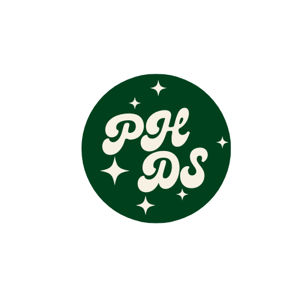

<a name="readme-top"/>

<br/>

<br />
<div align="center">
  <a href="https://github.com/Hermayni">


  </a>
  <h3 align="center">WD - Paricce Hermione Delos Santos' Resume</h3>
</div>
<div align="center">
  Informations about Paricce Delos Santos
</div>

<br />


---

<br />
<br />

<!-- TODO: If you want to add more layers for your readme -->
<details>
  <summary>Table of Contents</summary>
  <ol>
    <li>
      <a href="#overview">Overview</a>
      <ol>
        <li>
          <a href="#key-components">Key Components</a>
        </li>
        <li>
          <a href="#technology">Technology</a>
        </li>
      </ol>
    </li>
    <li>
      <a href="#rules-and-principles">Rules and Principles</a>
    </li>
    <li>
      <a href="#resources">Resources</a>
    </li>
  </ol>
</details>

---

## Overview

<!-- TODO: To be changed -->
Description of the project in details.

Guiding Question:
- What is the project
   <br>
   Seatwork 2, Resume
   <br>
   <br>
- Whats the purpose
<br>
to create a website about the programmer's whereabouts
<br>
<br>
- What are key components
<br>
To build a website resume using HTML and CSS, start with a solid HTML structure. This includes a header with your name, title, and navigation links, followed by main content sections such as About, Experience, Education, Skills, Projects, and Contact. Use appropriate HTML tags to organize the content within these sections. For styling, reset default browser styles and import any desired fonts.
<br>
<br>
- What technology used and how it is used
<br>
To build a website resume, HTML is used to structure the content, defining elements like headings, paragraphs, lists, links, and sections. For instance, you can organize your resume into sections such as About, Experience, Education, Skills, Projects, and Contact using HTML tags, CSS is then utilized to style these elements, controlling layout, colors, fonts, and overall appearance. With CSS, you can create a visually appealing design with responsive layouts that adapt well to different screen sizes.


### Key Components
<!-- TODO: List of Key Components -->

<ul>
  <li>Header</li>
  <li>Sections</li>
  <li>Content</li>
  <li>Styling</li>
  <li>Responsive Design</li>
  <li>Icons and Images</li>
  <li>Contact Form</li>
</ul>


### Technology
<!-- TODO: List of Technology Used -->


## Rules and Principles
1. Always use ***WD-*** in the Title of the Project for the Subject
2. Do not rename any .html files; always use 'index.html' as the filename.
3. File Structure to follow

```
WD-ProjectName
└─ assets
|   └─ css
|   |   └─ style.css
|   └─ js
|   |   └─ script.js
|   └─ img
|       └─ fileWith.jpeg/.jpg/.webp/.png
└─ pages
|  └─ pageName
|     └─ index.html
|     └─ assets
|        └─ css
|        |  └─ style.css
|        └─ js
|        |  └─ script.js
|        └─ img
|           └─ fileWith.jpeg/.jpg/.webp/.png
└─ index.html
└─ readme.md
```

## Resources


| Title | Purpose | Link |
|-|-|-|
| Create Responsive Coffee Website in HTML CSS and JavaScript Coffee Website in HTML and CSS | Used as a guide in creating the personal website | https://youtu.be/Rol0-FXOsms?si=2fjDDFMZl3Ekx-G9 |
